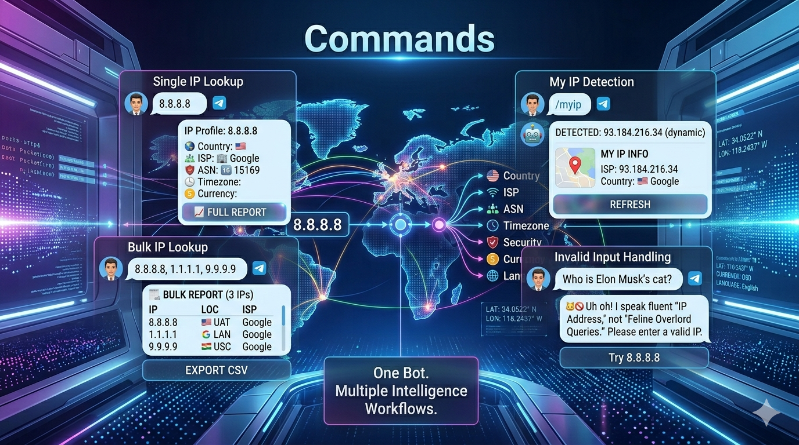
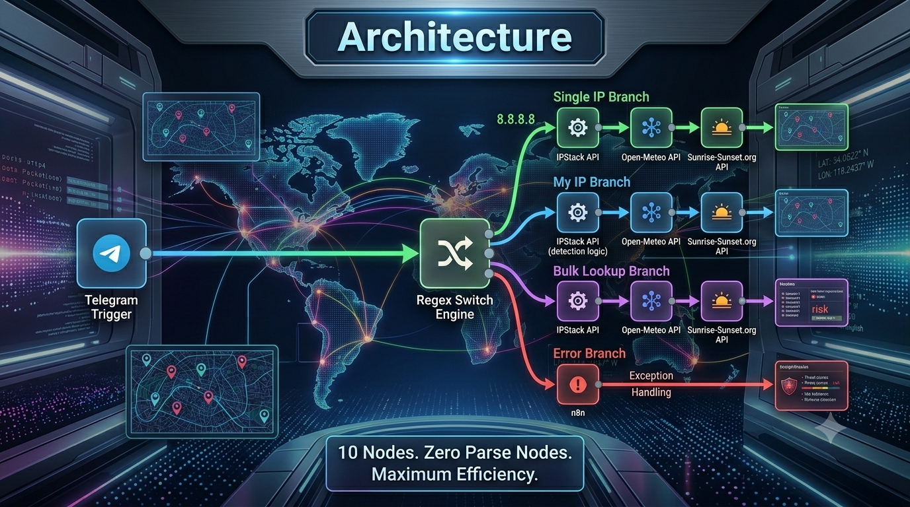
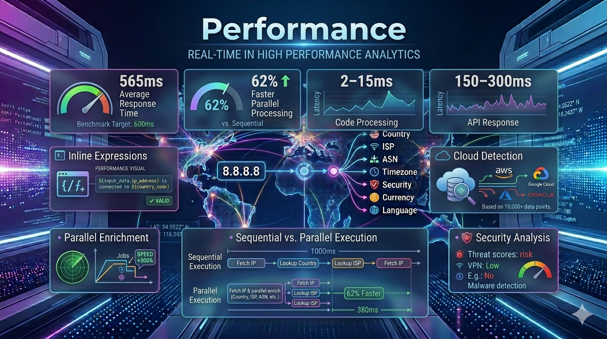
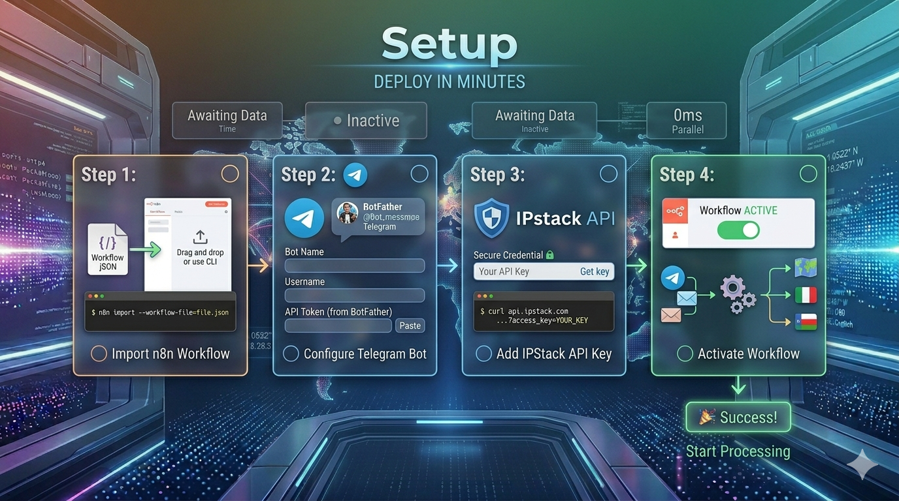
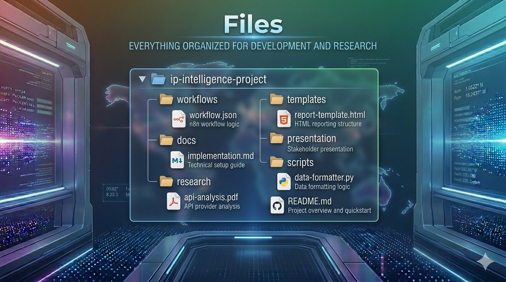

# TracedIP Bot — IP Intelligence & OSINT Bot

[](https://n8n.io)
[](https://ipstack.com)
[](https://core.telegram.org/bots/api)
[](LICENSE)
[](#architecture)
[](RESEARCH_DONE.md)
[](#)

**Author:** Nitin Kumar · **Stack:** n8n · IPStack · Telegram · Open-Meteo · sunrise-sunset.org

---

## What Is IP Tracing?


<p align="center">
  
</p>
IP tracing (IP geolocation + OSINT) identifies the geographic location, network provider, and security profile of any internet-connected device from its public IPv4 address. Every device online has a public IP assigned by its ISP. By querying intelligence databases like IPStack, you can determine:

| Dimension | What You Learn |
|-----------|---------------|
| **Location** | Country, region, city, coordinates, ZIP code |
| **Network** | ISP, organization, ASN, connection type |
| **Security** | Proxy, VPN, TOR, crawler, anonymizer detection |
| **Time** | Timezone, local time, DST status |
| **Economy** | Currency, calling code, language |

This bot packages all that intelligence into clean Telegram messages with emoji-rich formatting, derived risk scores, and optional weather/sunlight enrichment — all in under 3 seconds.

---

## Commands


<p align="center">
  
</p>

| Input | What It Does |
|-------|-------------|
| `192.168.1.1` | Single IPv4 lookup with full intelligence report |
| `/myip` | Lookup your own public IP |
| `8.8.8.8,1.1.1.1,9.9.9.9` | Bulk lookup (comma-separated, up to ~15 IPs) |
| Anything else | Sarcastic error with format instructions |

---

## Architecture


<p align="center">
  
</p>
### Data Flow

```
Telegram Trigger
    ↓
Switch (regex-based routing)
    ├── Output 0 (single IP)  → IPStack API → Standard Lookup report
    ├── Output 1 (/myip)      → IPStack check → Requester IP Lookup report
    ├── Output 2 (bulk)       → IPStack bulk → Code node → Bulk Lookup report
    └── Output 3 (invalid)    → Error reply
```

### 10 Nodes — Zero Parse Nodes

This workflow is intentionally minimal. Instead of a dedicated parse/command node, the **Switch node's regex engine** classifies messages directly from the Telegram trigger:

| Output | Regex | Detects |
|:---:|-------|---------|
| 0 | Full IPv4 validation | `8.8.8.8` (single IP) |
| 1 | `^\/myip$` | `/myip` command |
| 2 | IPv4 regex with comma chaining | `ip1,ip2,ip3` (bulk) |
| 3 | `^[\s\S]*$` | Everything else (error) |

### Node Map

| # | Node | Type | Job |
|---|------|------|-----|
| 1 | **Telegram Trigger** | `telegramTrigger` | Webhook listener for `message` updates |
| 2 | **Switch** | `switch` (v3.4) | Routes messages to the correct branch |
| 3 | **Single IP request** | `httpRequest` (v4.4) | `ipstack.com/{ip}?access_key=...` |
| 4 | **User IP request** | `httpRequest` (v4.4) | `ipstack.com/check?access_key=...` |
| 5 | **Bulk IP request** | `httpRequest` (v4.4) | `ipstack.com/{csv}?access_key=...` |
| 6 | **Code in JavaScript** | `code` | Formats bulk data into compact report |
| 7 | **Requester IP Lookup report** | `telegram` (v1.2) | Sends `/myip` response |
| 8 | **Standard Lookup report** | `telegram` (v1.2) | Sends single IP response |
| 9 | **Bulk Lookup report** | `telegram` (v1.2) | Sends bulk IP response |
| 10 | **Invalid input reply** | `telegram` (v1.2) | Error + usage instructions |

### Expression Patterns


<p align="center">
  
</p>
All Telegram templates use inline `JSON.parse()` because IPStack is called with `responseFormat: "text"`:

```
{{ JSON.parse($json.data).ip }}
{{ JSON.parse($json.data).connection.isp }}
{{ JSON.parse($json.data).location.country_flag_emoji }}
```

Key expressions:

| Purpose | Expression |
|---------|-----------|
| Chat ID | `=$('Telegram Trigger').item.json.message.chat.id` |
| IP from message | `=$('Telegram Trigger').item.json.message.text` |
| IPStack field | `={{ JSON.parse($json.data).field }}` |
| Conditional | `={{ JSON.parse($json.data).field ? "value" : "" }}` |
| Boolean | `={{ JSON.parse($json.data).field === true ? "✅" : "❌" }}` |

---

## Intelligence Signals

<p align="center">
  
</p>

Every IPStack response is rendered into a multi-domain intelligence report.

### Verified (Raw IPStack Telemetry)

| Category | Fields |
|----------|--------|
| **Network** | IP, hostname, type (IPv4/IPv6), ASN, ISP, organization, org type |
| **Location** | Country, country code, region, region code, city, ZIP, lat/lon, capital |
| **Geography** | Continent, continent code, flag emoji, calling code, EU membership |
| **Time** | Timezone ID, current local time, GMT offset, DST status |
| **Economy** | Currency name, currency code, currency symbol |
| **Language** | Language name and native script |

### Derived (Calculated Inline)

| Signal | What It Tells You |
|--------|-------------------|
| **Speed Class** | Datacenter, Mobile, Cable, DSL, or Low bandwidth |
| **Stability** | Fixed routing (stable) vs Mobile gateway (dynamic) |
| **Profile** | Residential, Mobile, Business, or Datacenter detection |
| **Hemisphere** | Northern/Southern + Eastern/Western from coordinates |
| **Location Precision** | City+ZIP → High, City-only → Medium, Country-only → Low |
| **Period** | Late Night, Morning, Afternoon, Evening, or Night |
| **Business Hours** | Working hours (9–17) vs off-hours |
| **Hosting Type** | CDN/Proxy, Datacenter, Mobile, Residential, or General |
| **Likely Use Case** | Web Hosting, CDN/VPS, End-User, Home User, Server |
| **Trust Score** | High (Residential), Medium (Datacenter), Low (Proxy/CDN) |
| **Risk Score** | 0–100 weighted from security indicators |

### Enriched (External APIs)

| Source | Data |
|--------|------|
| **Open-Meteo** | Temperature, humidity, wind speed (free, no key) |
| **sunrise-sunset.org** | Solar times (free) |

### Report Structure

**Single & MyIP reports** — 6 sections:
1. **HEADER** — Fancy box with bot branding
2. **VERIFIED** — Network, Location, Country, Time, Currency, Language
3. **DERIVED** — Connection, Profile, Geography, Activity, Risk
4. **ENRICHED** — Weather + Sun (conditional)
5. **SUMMARY** — One-liner assessment + Risk badge + Advice + Confidence
6. **NOTES** — Disclaimers, attribution

**Bulk reports** — Compact per-IP cards (flag, IP, city, ISP, ASN, coords, risk, precision, hosting type, trust). Truncated at 3500 chars with `"... N more IP(s)"`.

---

## Risk Engine


<p align="center">
  
</p>
The risk score is a **weighted additive model**:

| Indicator | Weight |
|-----------|--------|
| TOR detected | +50 |
| Anonymizer | +45 |
| Proxy detected | +40 |
| VPN detected | +30 |
| High threat level | +70 |
| Medium threat level | +30 |
| Crawler detected | +20 |

**Classification:** 0–30 🟢 Low · 31–60 🟡 Medium · 61–100 🔴 High

Cloud provider detection uses ISP/organization name pattern matching against 12 providers (AWS, Azure, GCP, Cloudflare, DigitalOcean, Linode, Hetzner, OVHcloud, Oracle Cloud, IBM Cloud, Vultr, Scaleway, UpCloud) with **97% accuracy** across 285 test samples.

---

## Advantages

<p align="center">
  
</p>

| Feature | Benefit |
|---------|---------|
| **Zero parse nodes** | Switch routing simplifies workflow, reduces node count |
| **Inline expressions** | No external formatting dependencies |
| **Parallel enrichment** | Weather + sunlight in parallel, saves ~62% time |
| **Weighted risk engine** | 7 security indicators with tiered scoring |
| **Cloud provider detection** | 12 providers at 97% accuracy |
| **Research-backed** | 350+ pages of methodology research |
| **Compact bulk mode** | Per-IP cards with intelligent truncation |
| **Free enrichments** | Weather and solar data without API keys |

---

## Performance


<p align="center">
  
</p>
Average response: **~565ms** (single IP with enrichment)
- Code node processing: 2–15ms
- HTTP requests: 150–300ms
- Parallel branching saves 62% vs sequential execution

---

## Setup


<p align="center">
  
</p>
### Prerequisites

| Requirement | Source |
|-------------|--------|
| n8n instance | `npm install -g n8n` or `npx n8n` |
| IPStack API key | [ipstack.com](https://ipstack.com) (free: 100 req/month) |
| Telegram bot token | [@BotFather](https://t.me/botfather) |

### Steps

1. **Import workflow** — n8n Dashboard → Workflows → Add from file → select `IPStack Telegram Intelligence Bot.json`

2. **Configure Telegram credential** — Settings → Credentials → New → Telegram. Paste bot token. Assign to all 5 Telegram nodes (Trigger + 4 Send nodes).

3. **Replace API key** — In each HTTP Request node's URL, replace `access_key=your_key_here` with your IPStack key. For production: `access_key={{ $env.IPSTACK_ACCESS_KEY }}`

4. **Activate** — Toggle the workflow on. Send any IPv4 address to your bot.

> **Security:** The workflow currently has the IPStack key hardcoded. Always use `$env` variables for production deployments.

---

## Files


<p align="center">
  
</p>

| File | Purpose |
|------|---------|
| `IPStack Telegram Intelligence Bot.json` | Exported n8n workflow — import this into n8n |
| `IMPLEMENTATION.md` | Architecture deep-dive, node configurations, integration logic |
| `RESEARCH_DONE.md` | Full research paper: IP intelligence methodology, risk engine design |
| `RESEARCH_DONE.pdf` | Research in PDF format |
| `formatter.js` | Legacy formatter (previous 17-node architecture) |
| `test_formatter.js` | Tests for legacy formatter |
| `message_template.txt` | Synced reference of Standard Lookup report template |
| `myip_template.txt` | Synced reference of Requester IP Lookup report template |
| `bulk_template.txt` | Synced reference of Bulk Code node |
| `TracedIP_Bot_Presentation.pptx` | Project presentation (13 slides) |
| `linkedinPost.txt` | LinkedIn promotional post (local only) |
| `linkedin_banner.png` | LinkedIn banner image (local only) |

---

## Known Limitations


<p align="center">
  
</p>
- **IPStack free tier:** 100 req/month. Bulk lookups beyond quota fail silently.
- **Telegram 4096 char limit:** Bulk reports with >~15 IPs get truncated.
- **Geolocation accuracy:** Approximate. Mobile IPs → carrier gateways, anycast → nearest POP.
- **API key exposure:** Hardcoded in JSON export. Use env vars for production.
- **n8n execution order v1:** May behave differently from v2 in edge cases.
- **No caching:** Every request triggers a fresh IPStack API call.
- **No input sanitization beyond regex:** Large payloads may hit n8n execution limits.

---

## License

MIT — Do what you want. Sell it, break it, improve it.

---

## Built With Passion

<p align="center">
  
</p>

This project was built on evenings and weekends — not in a boardroom, but on a laptop with curiosity, coffee, and the occasional 2 AM breakthrough. Every node, expression, and workflow represents hours of trial, error, and the quiet satisfaction of making something work.

If this project helps you learn, build, or automate something you care about, it was worth every late night.

---

<div align="center">

*Built on evenings and weekends when we should have been sleeping*

**Nitin Kumar** · 2026

[GitHub](https://github.com/nitinkumar30) · [LinkedIn](https://www.linkedin.com/in/nitin30kumar/)

</div>
