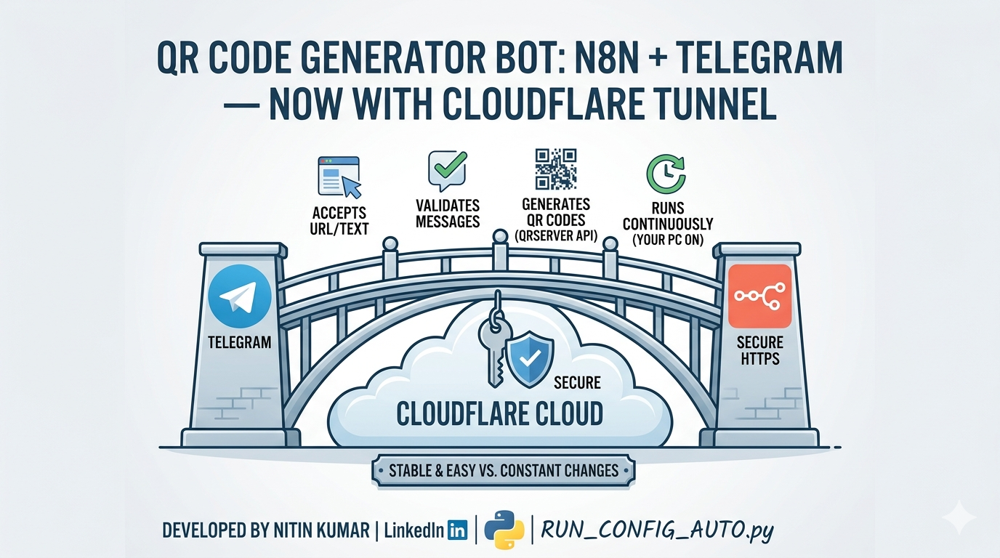
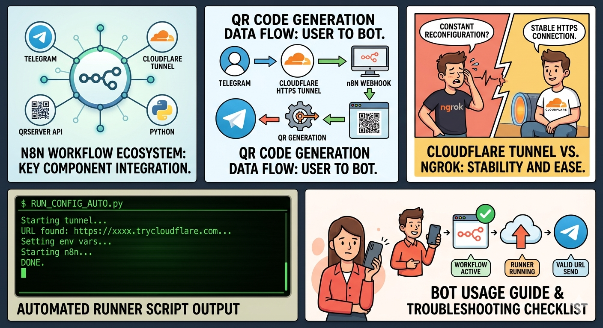
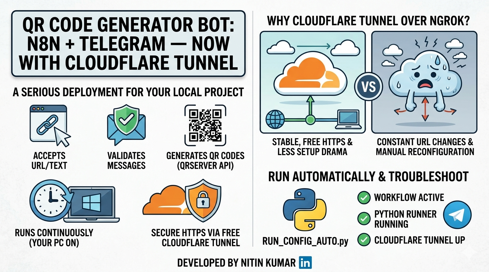
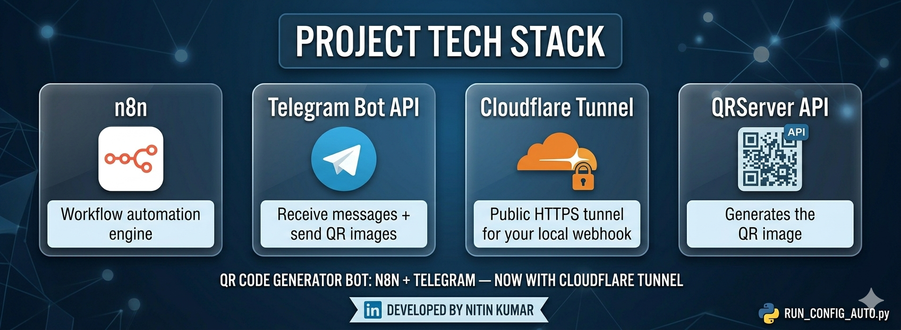
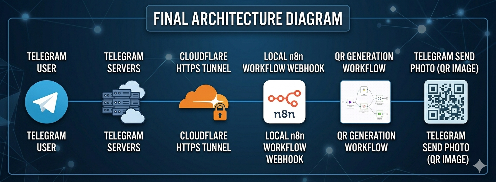
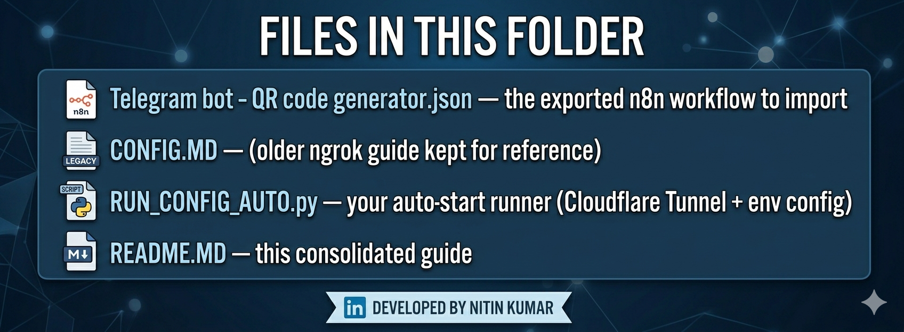
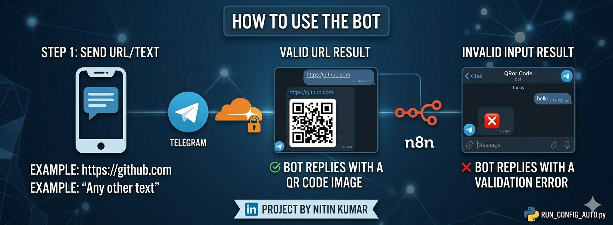

# 🫡✨ QR Code Generator Bot (n8n + Telegram) — now with Cloudflare Tunnel




This folder contains a Telegram bot workflow built in **n8n** that:

- ✅ accepts a URL/text from a Telegram chat
- ✅ validates it (so random nonsense doesn’t hit the QR API)
- ✅ generates a QR code via **QRServer**
- ✅ sends the QR image back to the user
- ✅ runs continuously on your machine (while your PC is ON) 🤖

And—most importantly—your webhook runs over **FREE HTTPS using Cloudflare Tunnel**, so you don’t have to reconfigure ngrok every 5 minutes. (ngrok, we hardly knew ye. 😭)

---

## 📌 What’s new in this implementation (vs the older ngrok-based approach)




This README consolidates everything from `NEW_IMPLEMENTATION.MD` + updates it into one single tracking file.




### Key changes implemented

- 🌐 **Replaced ngrok** with **Cloudflare Tunnel (cloudflared)**
- 🧠 **Added an auto-start Python runner** that:
  - starts Cloudflare Tunnel
  - parses the created public HTTPS URL
  - sets `WEBHOOK_URL`, `N8N_PROTOCOL`, `N8N_HOST` automatically
  - starts `n8n`
- ♾️ **Emphasized Active mode workflow** (continuous listening)
- 🧯 Documented common failure cases: test vs active mode, webhook HTTPS issues, etc.

---

## 🧩 Tech stack




| Tool | Purpose |
|---|---|
| **n8n** | Workflow automation engine |
| **Telegram Bot API** | Receive messages + send QR images |
| **Cloudflare Tunnel** | Public HTTPS tunnel for your local webhook |
| **QRServer API** | Generates the QR image |
| **Python** | Auto-start script (starts tunnel + sets env vars + starts n8n) |

---

## 🔧 Final architecture




```txt
Telegram User
   ↓
Telegram Servers
   ↓
Cloudflare HTTPS Tunnel
   ↓
Local n8n instance (webhook)
   ↓
QR Generation workflow
   ↓
Telegram Send Photo (QR image)
```

---

## 🤔 Why Cloudflare Tunnel over ngrok? (the friendly comparison)

.png)

### Cloudflare Tunnel advantages ✅

- 🆓 **FREE HTTPS** without constant “URL changes” drama
- 🔁 **More stable long-running tunnel** for continuous bots
- ⚙️ **Less manual setup** (because your Python script reads the tunnel URL and configures env vars automatically)
- 🚀 Better “set once, keep running” experience
- 🧘 Less mental overhead than ngrok (your future self thanks you)

### Why ngrok was removed ❌

- ❌ Free ngrok URLs can change frequently
- ❌ Manual restart + reconfiguration was required often
- ❌ Env var churn leads to “why does Telegram say HTTPS is wrong?” moments

Sarcastic summary: ngrok is fine—until you want the workflow to behave like an actual service. 😄

---

## 🧠 Workflow behavior (high level)

```txt
Telegram Trigger
   ↓
IF URL VALID?
   ↓ YES              ↓ NO
Generate QR        Send error message
   ↓
Send Photo
```

---

## 🧾 Files in this folder




- `Telegram bot - QR code generator.json` → the exported n8n workflow to import
- `CONFIG.MD` → (older ngrok guide kept for reference)
- `RUN_CONFIG_AUTO.py` → your auto-start runner (Cloudflare Tunnel + env config)
- `README.MD` → this consolidated guide

---

## 🚀 Option A: Run with Cloudflare Tunnel (recommended)

### Prerequisites

1) Install Node.js + n8n

```bash
npm install -g n8n
```

2) Install Python (and add to PATH)

Verify:

```bash
python --version
```

3) Install Cloudflare Tunnel (cloudflared)

Verify:

```bash
cloudflared --version
```

4) Create your Telegram bot

- Use **@BotFather** → `/newbot`
- Save the **BOT TOKEN**

---

### n8n + Telegram workflow setup

1) Start n8n for setup (browser access):

- Open: `http://localhost:5678`

2) Import the workflow from:

- `Telegram bot - QR code generator.json`

3) Configure Telegram Trigger credentials using your Bot Token.

4) IMPORTANT: Activate the workflow

- Click **ACTIVE** (top-right in n8n)
- Do **not** run only “Test” mode and expect Telegram webhooks to work.

---

### ✅ Run everything automatically (Cloudflare + env vars + n8n)

Run:

```bash
python RUN_CONFIG_AUTO.py
```

Your script does the following:

- starts `cloudflared tunnel --url http://localhost:5678`
- reads tunnel logs
- extracts the public URL like `https://xxxx.trycloudflare.com`
- sets:
  - `WEBHOOK_URL`
  - `N8N_PROTOCOL`
  - `N8N_HOST`
- starts `n8n start`

Result: you get a public HTTPS webhook without babysitting ngrok like a fragile houseplant. 🪴😄

---

## 🧷 Option B: Run with ngrok (legacy / reference)

If you ever need ngrok, use the existing `CONFIG.MD` in this folder.

Core idea:

- Telegram requires **HTTPS**
- ngrok provides HTTPS → forward to `localhost:5678`
- set env vars before starting n8n:
  - `WEBHOOK_URL`
  - `N8N_PROTOCOL=https`
  - `N8N_HOST=<ngrok domain>`

---

## 📣 How to use the bot




Send a message like:

```txt
https://github.com
```

Expected result:

- Bot replies with a **QR code image** ✅

Send something invalid like:

```txt
hello
```

Expected result:

- Bot replies with a validation error ❌

---

## ⚠️ Common problems (and the actual reasons)

![Common [problems]](./images/Common_problems_(and_the_actual_reasons).png)


### 1) HTTPS webhook error

**Cause:** using localhost / HTTP instead of HTTPS.

**Fix:** use Cloudflare Tunnel (or ngrok) so Telegram gets a public HTTPS URL.

---

### 2) Trigger works only once

**Cause:** you used **Test Workflow** instead of **ACTIVE**.

**Fix:** activate the workflow and keep the runner running.

---

### 3) Telegram webhook conflict

**Cause:** testing and active listening simultaneously.

**Fix:** only keep workflow in **ACTIVE** mode.

---

## ✅ Checklist before you blame Telegram

- [ ] Workflow is **ACTIVE**
- [ ] Python runner is running
- [ ] Cloudflare tunnel is up
- [ ] PC has internet
- [ ] You used a valid Telegram bot token

Then blame Telegram (politely). 😄

---

## 👨‍💻 Author

[Nitin Kumar](https://www.linkedin.com/in/nitin30kumar/)

